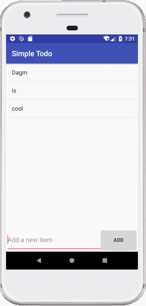

# Project 1 - *SimpleTodo*

**SimpleTodo** is an android app that allows building a todo list and basic todo items management functionality including adding new items, editing and deleting an existing item.

Submitted by: **Dagm Behailu**

Time spent: **~6** hours spent in total

## User Stories

The following **required** functionality is completed:

* [x] User can **view a list of todo items**
* [x] User can **successfully add and remove items** from the todo list
* [x] User's **list of items persisted** upon modification and and retrieved properly on app restart

The following **optional** features are implemented:

* [x] User can **tap a todo item in the list and bring up an edit screen for the todo item** and then have any changes to the text reflected in the todo list

The following **additional** features are implemented:

* [ ] List anything else that you can get done to improve the app functionality!

## Video Walkthrough

Here's a walkthrough of implemented user stories:

GIF created with [RecordIt](http://recordit.co/).

## Notes

Describe any challenges encountered while building the app.

I discovered very early on that small mistakes can hinder work very fast. I struggled for a few minutes trying to diagnose why components in my app were bunching up when I ran them on my device. In retrospect, I realize that it was not extremely important, and my time would have been better spent completing the main objectives of the app. Fortunately, I was able to debug the problem very quickly with the help of one of our TAs.

I did, however, learn that if I find a solution to a problem then it is very important to figure out why that solution worked or why I used it. Earlier during the day, I chose to use my device to display my app because I was having trouble using the emulator. I figured this was a good solution because I would not have to deal with the emulator anymore. However, later I realized that I would have to redo that process again if I wanted to create a gif with the screen recording software on the Mac. My time may have been better spent setting it up correctly the first time.

## License

    Copyright [2018] [Dagm Behailu]

    Licensed under the Apache License, Version 2.0 (the "License");
    you may not use this file except in compliance with the License.
    You may obtain a copy of the License at

        http://www.apache.org/licenses/LICENSE-2.0

    Unless required by applicable law or agreed to in writing, software
    distributed under the License is distributed on an "AS IS" BASIS,
    WITHOUT WARRANTIES OR CONDITIONS OF ANY KIND, either express or implied.
    See the License for the specific language governing permissions and
    limitations under the License.
